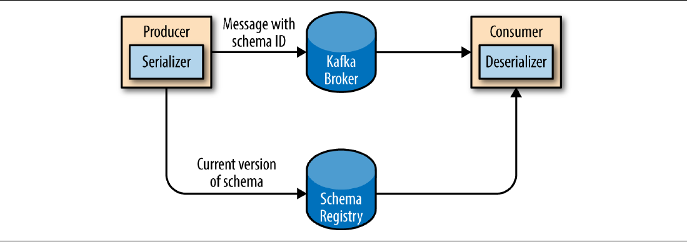
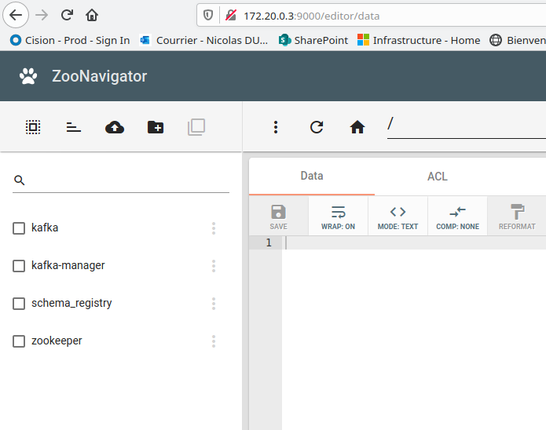
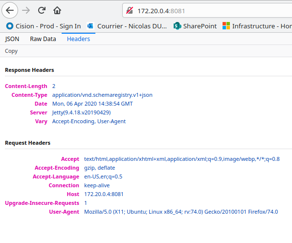
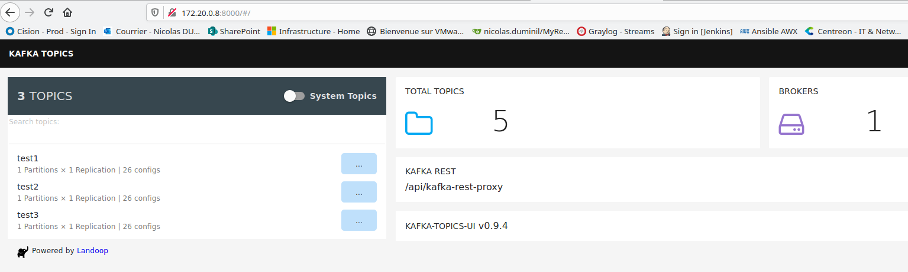
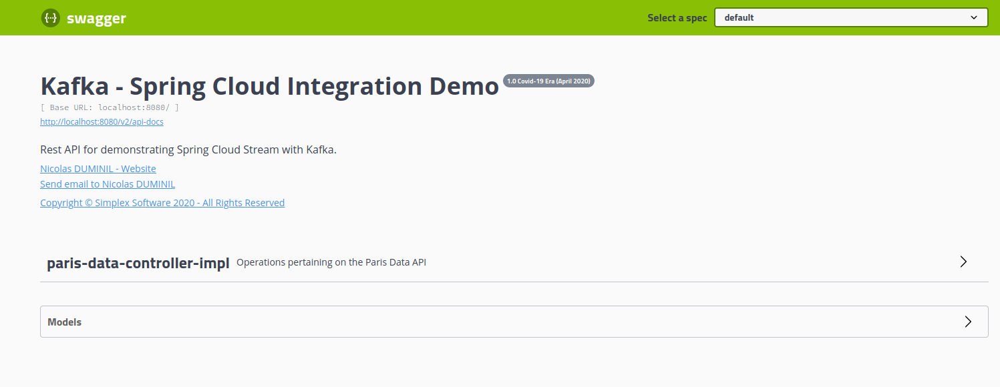
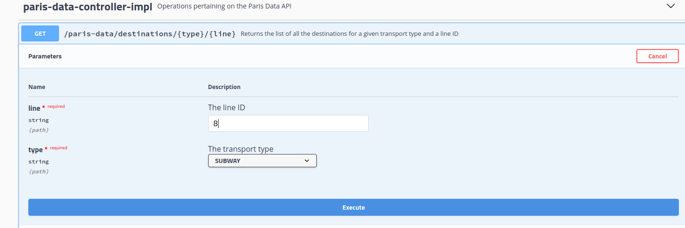
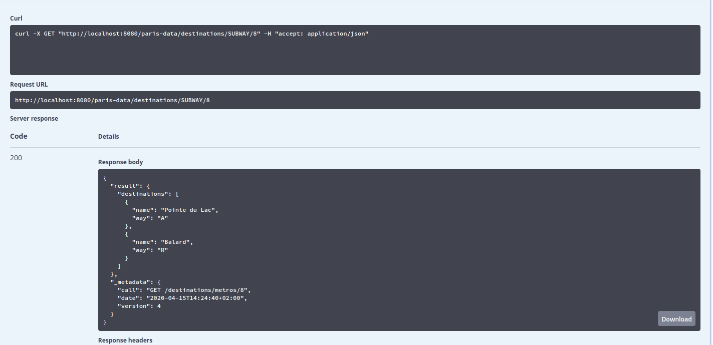
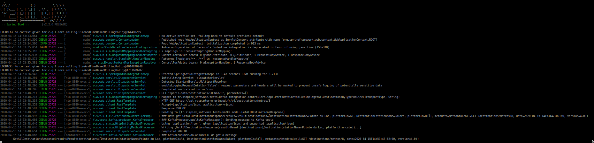
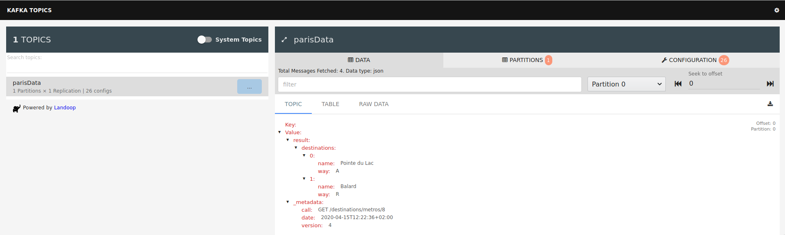

# Kafka Integration with Spring Cloud
Spring Cloud is a Spring project which aims at providing tools for developers 
helping them to quickly implement some of the most common design patterns like:
configuration management, service discovery, circuit breakers, routing, proxy,
control bus, one-time tokens, global locks, leadership election, distributed 
sessions and much more.
 
One of the most interesting Spring Cloud sub-projects is Spring Cloud Streams 
which provides an annotation driven framework to build message publishers and 
subscribers. It supports the most recent messaging platforms like RabbitMQ and
Kafka and abstracts away their implementation details.
  
This project is demonstrating Spring Cloud Streams with Kafka platforms.
 
## The Kafka Infrastructure
In a most authentic devops approach, our project is structured such that to 
use Docker containers. Our Kafla infrastructure is defined in the 
docker-compose.yml file, as follows:
 

    version: '3.7'
    services:
      zookeeper:
        image: confluentinc/cp-zookeeper:5.3.1
        hostname: zookeeper
        container_name: zookeeper
        ports:
          - 2181:2181
        environment:
          ZOOKEEPER_SERVER_ID: 1
          ZOOKEEPER_CLIENT_PORT: 2181
          ZOOKEEPER_TICK_TIME: 2000
          ZOOKEEPER_INIT_LIMIT: 5
          ZOOKEEPER_SYNC_LIMIT: 2
          ZOOKEEPER_SERVERS: zookeeper:2888:3888
        volumes:
          - /var/lib/zookeeper:/var/lib/zookeeper
      kafka:
        image: confluentinc/cp-kafka:5.3.1
        hostname: kafka
        container_name: kafka-broker
        ports:
          - "29092:29092"
          - "9092:9092"
        depends_on:
          - zookeeper
        environment:
          KAFKA_BROKER_ID: 1
          KAFKA_ZOOKEEPER_CONNECT: zookeeper:2181/kafka
          KAFKA_ADVERTISED_LISTENERS: PLAINTEXT://kafka:29092,PLAINTEXT_HOST://kafka:9092
          KAFKA_LISTENER_SECURITY_PROTOCOL_MAP: PLAINTEXT:PLAINTEXT,PLAINTEXT_HOST:PLAINTEXT
          KAFKA_OFFSETS_TOPIC_REPLICATION_FACTOR: 1
          KAFKA_GROUP_INITIAL_REBALANCE_DELAY_MS: 0
        volumes:
          - /var/lib/kafka:/var/lib/kafka
          - ./scripts/:/scripts
      schema-registry:
        image: confluentinc/cp-schema-registry:5.3.1
        container_name: schema-registry
        depends_on:
          - zookeeper
        ports:
          - 8081:8081
        environment:
          SCHEMA_REGISTRY_KAFKASTORE_CONNECTION_URL: zookeeper:2181/kafka
          SCHEMA_REGISTRY_LISTENERS: "http://0.0.0.0:8081"
          SCHEMA_REGISTRY_HOST_NAME: schema-registry
      kafka-rest-proxy:
        image: confluentinc/cp-kafka-rest:5.3.1
        hostname: kafka-rest-proxy
        container_name: kafka-rest-proxy
        depends_on:
          - zookeeper
          - kafka
          - schema-registry
        ports:
          - 8082:8082
        environment:
          KAFKA_REST_HOST_NAME: kafka-rest-proxy
          KAFKA_REST_BOOTSTRAP_SERVERS: kafka:29092
          KAFKA_REST_LISTENERS: "http://0.0.0.0:8082"
          KAFKA_REST_SCHEMA_REGISTRY_URL: 'http://schema-registry:8081'
          KAFKA_REST_CONSUMER_REQUEST_TIMEOUT_MS: 30000
          TZ: "${TZ-Europe/Paris}"
      kafka-topics-ui:
        image: landoop/kafka-topics-ui:0.9.4
        container_name: kafka-ui
        depends_on:
          - kafka-rest-proxy
        ports:
          - 8000:8000
        environment:
          KAFKA_REST_PROXY_URL: http://kafka-rest-proxy:8082
          PROXY: "true"
      zoonavigator:
        image: elkozmon/zoonavigator:0.7.1
        container_name: zoonavigator
        depends_on:
          - zookeeper
        environment:
          HTTP_PORT: 9000
          AUTO_CONNECT_CONNECTION_STRING: zookeeper:2181
      kafka_manager:
        image: hlebalbau/kafka-manager:stable
        container_name: kafka-manager
        ports:
          - "9000:9000"
        depends_on:
          - kafka
          - zookeeper
        environment:
          ZK_HOSTS: "zookeeper:2181"
          APPLICATION_SECRET: "random-secret"
          KAFKA_MANAGER_AUTH_ENABLED: "true"
          KAFKA_MANAGER_USERNAME: username
          KAFKA_MANAGER_PASSWORD: password
        command: -Dpidfile.path=/dev/null

As this infrastructure might seem quite complex, it is explained below.

### Zookeeper
Kafka is, besides other, a message broker and, like any other message broker, 
it may be clusterized. This means that several Kafka message brokers might be 
connected such that to provide a distributed messaging environment. 

ZooKeeper is a centralized service for storing and maintaining configuration 
and naming information. It provides grouping and distributed synchronization to
other services. 

Kafka uses Apache Zookeeper to maintain the list of brokers that are currently 
 members of a cluster. Every broker has a unique identifier that is either set
 in the broker configuration file or automatically generated. Every time a 
broker process starts, it registers itself with its ID in Zookeeper by 
creating an ephemeral node. Different Kafka components subscribe to the 
brokers defined path in Zookeeper.

The first Docker container in our infrastructure above is then running an 
instance of the Apache Zookeeper service. The Docker image 
`confluentinc/cp-zookeeper`  comes from Docker Hub and is provided by 
Confluent. It exposes the TCP port number 2181 and mounts the `/var/lib/zookeeper`
as a read-write volume. Several environment variables are defined, as documented
at DockerHub (https://hub.docker.com/r/confluentinc/cp-zookeeper). In a real 
infrastructure several Zookeeper instances would probably be required but here,
 for simplicity sake, we're using only one.

### Kafka
The second piece in our puzzle is the Kafka broker itself. The Docker image
`confluentinc/cp-kafka:5.3.1` is provided by Cofluent as well and the container
configuration is self-explanatory. The documentation 
(https://hub.docker.com/r/confluentinc/cp-kafka) provides full details.

### Schema Registry
As a messaging and streaming platform, Kafka is used to exchange information in
 the form of business objects that are published by message producers to 
 Kafka topics, to which message consumers are subscribing in order to retrieve 
them. Hence, these business objects have to be serialized by the producer and 
deserialized by the consumer.

Kafka includes out-of-the-box serializers/deserializers for different data 
types like integers, `ByteArrays`, etc. but they don't cover most use cases. 
When the data to be exchanged is not in the form of simple strings or integers,
a more elaborated serialization/deserialization is required. This is done using
specialized libraries like Avro, Thrift or Protobuf.

The prefered way to serialze.unserialize data in Kafka is on the behalf of the 
Apache Avro library. But whatever the library is, it is based on a so called 
serialization/deserialization schema. This is a JSON file describing the 
serialization/deserialization rules. So, whatever the library is, it requires a
way to store the this schema. Avro, for example, stores it directly in the binary
file hosting the serialized objects, but there is a better way to handle this 
for Kafka messages.

Since locating the serialization/deserialization schema in each serialized file
might come with some overhead, the best practices are to use a schema registry 
for this purpose. The Schema Registry is not part of Apache Kafka but there are
several open source options to choose from. Here we’ll use the Confluent Schema
Registry. The idea is to store all the schemas used to write data to Kafka in 
the registry. Then we simply store the identifier for the schema in the record 
we produce to Kafka. The consumers can then use the identifier to pull the record
out of the schema registry and deserialize the data. The key is that all this 
work, which consists in storing the schema in the registry and pulling it up when
required, is done in the serializers and deserializers. The code that produces 
data to Kafka or that consumes data from Kafka simply uses the Avro serializer 
/ deserializer, without any concern of where the associated schema is stored.

The figure below illustrates this process.



So, the next Docker container of our infrastructure is the one running the 
Confluent Schema Registry. Noting of particular here other then that it exposes
the TCP port 8081 and that it defines a couple of environment variables, as
required by the documentation https://hub.docker.com/r/confluentinc/cp-schema-registry.

### Kafka REST Proxy
The Kafka REST Proxy is a RESTful interface to a Kafka cluster, making it 
easy to produce and consume messages, view the state of the cluster, and 
perform administrative actions without using the native Kafka protocol or clients.
This is a very useful component which is not a part of the Kafka itself neither,
but it belongs to the Confluent Kafka adds-on series. 

The docker image ``confluentinc/cp-kafka-rest`` contains the Confluent REST Proxy
for Kafka. Its documentation may be found here: 
https://hub.docker.com/r/confluentinc/cp-kafka-rest. The configuration is simple
and it doesn't require anything of special. The environment variables defined 
here are explained in the documentation. To resume, we're configuring the Kafka
broker address, the schema-registry one, as well as the REST proxy hostname. An
interesting point to be noticed is the listener at ``0.0.0.0:8082`` which is 
the addres of the kafka-topics-ui container, explained below.

### Kafka Topics UI
The Kafka Topics UI is a user interface that interacts with the Kafka REST Proxy
to allow browsing Kafka topics, to inspect messages and, more generally, see 
what exactly happens in your Kafka clusters. Hence, the next piece of our puzzle
is a Docker container running the image named ``landoop/kafka-topics-ui`` which 
documentation may be found here: https://hub.docker.com/r/landoop/kafka-topics-ui.
The configuration is just exposing the TCP port number 8000 and setting the Kafka
REST proxy IP address (DNS name) and TCP port.

### Zoo Navigator
As we have seen, Kafka clusters are using Apache ZooKeeper in order to persist the
required information concerning brokers, nodes, topics, etc. Zoo Navigator is 
another add-on tool which allows for browsing, in an user friendly way, the 
information stored in the ZooKeeper repositories. The associated Docker container 
is based, as shown, on the ``elkozmon/zoonavigator`` image which documentation may 
be found here. The configuration exposes the TCP port number 9000 and defines the 
ZooKeeper server IP address (DNS name) and TCP port number.                                                                  required aithentication credentials

### Kafka Manager
The last piece of our puzzle is the Kafka Manager. This component is another 
optional add-on which provides the confort of a GUI on the behalf of which the 
most common administration operations on the Kafka brokers and topics may be 
performed. Of course, all these operations can be done using the Kafka CLI 
(Command Line Interface), which is a part of the Kafka package, but for those 
who prefer the click and drag approach to the austerity of a CLI, this manager 
is a nice alternative.

This Docker container is based on the image ``hlebalbau/kafka-manager`` which 
documentation may be found here: https://github.com/hleb-albau/kafka-manager-docker.
The configuration exposes the TCP port number 9000and defines the ZooKeeper server 
IP address (DNS name) and TCP port number, as well as the required authentication 
credentials.

## Exercicing the Infrastructure
To exercice the presented infrastructure, just proceed as follows:
1. Clone the project from GitHub:

        git clone https://github.com/nicolasduminil/kafka-spring-integration.git  
2. Build the project:       

        mvn -DskipTests clean install
3. Check wether the Docker containers are up and running:        

        docker ps
    You'll see the following listing:        

        CONTAINER ID        IMAGE                                   COMMAND                  CREATED             STATUS                            PORTS                                              NAMES
        eabab85946fe        landoop/kafka-topics-ui:0.9.4           "/run.sh"                6 seconds ago       Up 5 seconds                      0.0.0.0:8000->8000/tcp                             kafka-ui
        3861367a32a3        hlebalbau/kafka-manager:stable          "/kafka-manager/bin/…"   7 seconds ago       Up 5 seconds                      0.0.0.0:9000->9000/tcp                             kafka-manager
        2f8456c34e6e        confluentinc/cp-kafka-rest:5.3.1        "/etc/confluent/dock…"   7 seconds ago       Up 6 seconds                      0.0.0.0:8082->8082/tcp                             kafka-rest-proxy
        45ddb2275aab        elkozmon/zoonavigator:0.7.1             "./run.sh"               8 seconds ago       Up 7 seconds (health: starting)   9000/tcp                                           zoonavigator
        969cd4d28c7d        confluentinc/cp-kafka:5.3.1             "/etc/confluent/dock…"   8 seconds ago       Up 6 seconds                      0.0.0.0:9092->9092/tcp, 0.0.0.0:29092->29092/tcp   kafka-broker
        b63e9dbaa57b        confluentinc/cp-schema-registry:5.3.1   "/etc/confluent/dock…"   8 seconds ago       Up 8 seconds                      0.0.0.0:8081->8081/tcp                             schema-registry
        03711a4deba8        confluentinc/cp-zookeeper:5.3.1         "/etc/confluent/dock…"   9 seconds ago       Up 8 seconds                      2888/tcp, 0.0.0.0:2181->2181/tcp, 3888/tcp         zookeeper
4. Now that all our infrastructure seems to be running, let's start using it. 
Let's create some Kafka topics and publish/subscribe messages to/from them.

        nicolas@kfx:~/workspace/spring-kafka-integration$ docker exec -ti kafka-broker /bin/bash
        root@kafka:/# cd scripts
        root@kafka:/scripts# ./kafka-test.sh
        Created topic test.
        Topic:test      PartitionCount:1        ReplicationFactor:1     Configs:
                Topic: test     Partition: 0    Leader: 1       Replicas: 1     Isr: 1
        >>>Test message 1
        Test message 2
        [2020-04-06 14:10:02,809] ERROR Error processing message, terminating consumer process:  (kafka.tools.ConsoleConsumer$)
        org.apache.kafka.common.errors.TimeoutException
        Processed a total of 2 messages
        Topic test is marked for deletion.
        Note: This will have no impact if delete.topic.enable is not set to true.
        root@kafka:/scripts# 
    Here we are first connecting to our Docker container running the Kafka broker.
    Then, in the ``scripts`` subdirectory, there is a *shell* script named 
    ``kafka-test.sh``. Running this script will create a topic named ``Test``. 
    Once this topic created, the script will publish two test messages on it, 
    after which these two test messages will be consumed and displayed. Finally, 
    the test topic is removed. Here is the source of the script: 
    
        root@kafka:/scripts#  cat kafka-test.sh
        kafka-topics --create --zookeeper zookeeper:2181/kafka --replication-factor 1 --partitions 1 --topic test
        kafka-topics --describe --zookeeper zookeeper:2181/kafka --topic test
        kafka-console-producer --broker-list localhost:29092 --topic test <<EOF
        Test message 1
        Test message 2
        EOF
        kafka-console-consumer --topic test --from-beginning --timeout-ms 5000 --bootstrap-server localhost:29092
        kafka-topics --delete --zookeeper zookeeper:2181/kafka --topic test 
        root@kafka:/scripts#
    As you may see, Kafka comes out-of-the-box with a CLI having commands like 
    ``kafka-topics``, ``kafka-console-producer`` and ``kafka-console-consumer``
    which allow to create/handle topics and to produce/consume messages.
    
5.  Let's try to probe now ZooKeeper by using the ZooKeeper Navigator. Get the 
IP address of the ``zoonavigator`` container and fire your browser on the TCP 
port number 9000.            

        nicolas@kfx:~/workspace/spring-kafka-integration$ docker exec -ti zoonavigator hostname -I
        172.20.0.3 
        nicolas@kfx:~/workspace/spring-kafka-integration$ open http://172.20.0.3:900
        
        
    
6. The next add-on that we need to probe is the Schema Registry.    

        nicolas@kfx:~/workspace/spring-kafka-integration$ docker exec -ti schema-registry hostname -I
        172.20.0.4 
        nicolas@kfx:~/workspace/spring-kafka-integration$ open 172.20.0.4:8081
        
    
    
7. Let's do the same for Kafka Topics UI.

        nicolas@kfx:~/workspace/spring-kafka-integration$ docker exec -ti kafka-broker /bin/bash
        root@kafka:/# cd scripts
        root@kafka:/scripts# ls -al
        total 16
        drwxrwxr-x 2 1000 1000 4096 Apr  6 14:07 .
        drwxr-xr-x 1 root root 4096 Apr  6 14:08 ..
        -rwxrwxr-x 1 1000 1000  731 Apr  1 13:39 kafka-test-topics.sh
        -rwxrwxr-x 1 1000 1000  455 Apr  6 14:07 kafka-test.sh
        root@kafka:/scripts# ./kafka-test-topics.sh 
        Created topic test1.
        >>>Created topic test2.
        >>>Created topic test3.
        >>>                
        root@kafka:/scripts# exit
        exit
        nicolas@kfx:~/workspace/spring-kafka-integration$ docker exec -ti kafka-ui ip addr
        1: lo: <LOOPBACK,UP,LOWER_UP> mtu 65536 qdisc noqueue state UNKNOWN qlen 1000
            link/loopback 00:00:00:00:00:00 brd 00:00:00:00:00:00
            inet 127.0.0.1/8 scope host lo
               valid_lft forever preferred_lft forever
        54: eth0@if55: <BROADCAST,MULTICAST,UP,LOWER_UP,M-DOWN> mtu 1500 qdisc noqueue state UP 
            link/ether 02:42:ac:14:00:08 brd ff:ff:ff:ff:ff:ff
            inet 172.20.0.8/16 brd 172.20.255.255 scope global eth0
               valid_lft forever preferred_lft forever
        nicolas@kfx:~/workspace/spring-kafka-integration$ open http://172.20.0.8:8000
    Here we are first connecting again to our Kafka Broker container and we 
    execute the script ``scripts/kafka-test-topics.sh``. This script will create
    some topics, exactly the same way as we did at the #4. We need to do that in
    order to probe Kafka Topics UI. Once the script terminated and the topics 
    created, we get the IP address of the Kafka Topics UI container and then we 
    fire our browser to the Kafka Topics UI URL. The following screen will 
    present to us: 
    
    
    
    Here we can see our test topics named ``test1``, ``test2`` and ``test3`` 
    that were created by the script we ran previously. If you press the button
    labeled ``System Topics`` on the top of the scree, you'll se other two system 
    topics. In total, 5 topics, as shown in the right pane of the screen.
    You can also see that there is only one Kafka broker and that the Kafka 
    REST Proxy is configured as well.
    
 8. Last add-on to probe is Kafka Manager and this is let as an exercice for the
  reader.
  
## The Spring Cloud Integration
Now that all our docker services are up and running, let's look at the Java code.
Our project is using Spring Boot Modules and, as such, it is structured is three
modules, as follows:
* a master maven module named ``spring-kafka-integration`` of packaging type ``pom``
* a main module named ``spring-kafka-app`` containg the Spring Boot application 
main class, together with a REST controller allowing to invoke the application's
API.
* a module named ``spring-kafka-producer`` implementing the Kafka messaging 
production logic
.
* a module named ``spring-kafka-consumer`` implementing the Kafka messaging
consumption logic.

### Building and Testing
In order to build the project first cd into the main directory and run the maven 
build, as follows:
    
    cd <root-directory>
    mvn -DskipTests clean install
    
Once the commands above executed, all the required containers must be up and 
running, as explained previously. Now you can test the services.

In order to perform testing, you need to invoke an API exposed by the application.
This may be done in several ways but one of the most convenient one is through 
Swagger. For that, you need to start the Spring Boot container, as follows:

    mvn -DskipTests -pl spring-kafka-app spring-boot:run

Once the application starts, going at ``http://localhost:8080``, you'll see the 
following API:
     

The API shown in the figure above is called ``paris-data-controller`` and exposes
endpoints allowing to retrieve information concerning the public transport in 
Paris. The API uses a set of web services, made available by Pierre GRIMAUD 
(``https://fr.linkedin.com/in/pgrimaud``) under an open source licence. These
services, developed in Python and available at ``https://api-ratp.pierre-grimaud.fr/v4``
and they are called by our API.

So, you can exercice now the API using the Swagger GUI, by clicking on the 
"Try it out" button, after having unfolded the operations, by clicking on the 
arrow on the left. For the purposes of our demo, we only provide one operation,
a GET which retrieves the stations available on a given public transport line.
Two parameters are required, the type od transport, for example SUBWAY, and the
line id, in our case 8, for the subway line M8. Here is how your test should 
look like:


Clicking on the Execute button the test will be ran and you'l get the following
result:
 

Now, looking at your shell screen where you started the Spring Boot application,
you'll see the listing below:


This listing shows that our Swagger GUI invokes our API by making a GET request 
using the URI ```/paris-data/destinations/SUBWAY/8```. Our API will, in turn, 
make a GET request at the end point 
``https://api-ratp.pierre-grimaud.fr/v4/destinations/metros/8`` to retrieve the 
required data, i.e. the subway stations on the M8 line, which are Pointe du Lac, 
platform A and Ballard, platform R.

But more interesting is that, once the remote web service endpoint is invoked and
the result returned, this returned will be published on a Kafka topic, as shown
in the log by the following message:

    ### Have got GetAllDestinationsResponse(result=Result(destinations=[Destination(stationName=Pointe du Lac, platformId=A), Destination(stationName=Balard, platformId=R)]), metadata=Metadata(call=GET /destinations/metros/8, date=2020-04-15T14:53:47+02:00, version=4.0))

This message is further consumed as shown below:

    ### KafkaConsumer.doConsume(): We got a message 
            GetAllDestinationsResponse(result=Result(destinations=[Destination(stationName=Pointe du Lac, platformId=A), Destination(stationName=Balard, platformId=R)]), metadata=Metadata(call=GET /destinations/metros/8, date=2020-04-15T14:53:47+02:00, version=4.0))
            
These messages are displayed by the Kafka Producer and, respectivelly, the Kafka
Consumer, showing that the message has been successfully sent and received. You can
further analyze what exactly happened by using the kafka-topics-ui service, as shown 
previously. Hence, going at ``http://192.168.96.6:8000``, we'll see a Kafka topic
named parisData having the following content:
    

Here we can see our message that have been produced to the topic parisData and 
further consumed.

## Show Me the Code
We just have demonstrated a Spring Boot application using Spring Cloud Streams such 
that to produce and consume messages to/from Kafka topics. But how everything 
works here ? Let's look at the code.

First, the main class is annotated as follows:

    @EnableBinding({Source.class, Sink.class})
    
This annotation has the effect of binding the Spring Cloud Stream framework to 
Kafka messaging system. This binding operation is performed on the behalf of a 
communication channel. Spring Cloud Stream makes available two standard channels,
named ``Source`` and, respectivelly, ``Sink``, the first aiming at publishing and
the last at subscribing to messages. Of course, channels may and shall be 
customized, instead of using the Spring Cloud Stream standard classes, which 
only cover a limited diversity of use cases. But for simplicity sake we choose
here to use a simpler and out-of-the-box solution instead of a more specific one.

The following listing shows the ``KafkaProducer`` class.

    @Component
    @Slf4j
    public class KafkaProducer
    {
      private Source source;
    
      @Autowired
      public KafkaProducer(Source source)
      {
        this.source = source;
      }
    
      public void publishKafkaMessage(GetAllDestinationsResponse msg)
      {
        log.debug("### KafkaProducer.publisKafkaMessage(): Sending message to Kafka topic");
        source.output().send(MessageBuilder.withPayload(msg).build());
      }
    }
    
That's all. The only thing you need here is to inject an instance of the 
``Source`` which is used further, in the method `publishKafkaMessage()` to
produce messages. The `KafkaConsumer` class is very simple as well:

    @Component
    @Slf4j
    public class KafkaConsumer
    {
      @StreamListener(Sink.INPUT)
      public void doConsume(@Payload GetAllDestinationsResponse msg)
      {
        log.debug ("### KafkaConsumer.doConsume(): We got a message \n\t{}", msg);
      }
    }
    
The `doConsume()` method needs only to be annotated with the `@StreamListener` 
annotation. The class Sink is configured such that to have an input channel,
named INPUT. Then using this very simple construct, the method `doConsume()`
is listening on the input channel of the Sink service and, whenever a 
message is received, it will get executed. In our case the execution is 
simple as it just logs a message in the log file.

The code above is every thing you need to implement complex Kafka messaging.
However, at this point, things might seem a bit like magic 'cause we didn't 
show anything concerning the Kafka brokers, the topics, etc. There is 
another good news as handling all these details could de done automatically,
only based on a couple of properties, like shown bellow in the 
application.properties file: 

    spring.application.name=spring-kafka-integration
    spring.cloud.stream.kafka.binder.brokers=192.168.96.3:9092
    spring.cloud.stream.bindings.input.destination=parisData
    spring.cloud.stream.bindings.input.contentType=application/json
    spring.cloud.stream.bindings.output.destination=parisData
    spring.cloud.stream.bindings.output.contentType=application/json
    
These proprties are doing the mapping between the `Source` and `Sink` classes
of Spring Cloud Streams and a Kafka broker and topic. As you can see, the 
Kafka broker IP address and TCP port are configured, as well as the Kafka topic 
name associated to the input and output channels.

Using this simple use case you can implement services communicating each other 
in an asynchrounous manner, using messaging. Spring Cloud Stream acts a middleman
for the services while the message broker is used as an abstraction layer over 
the messaging system.

Enjoy !                 